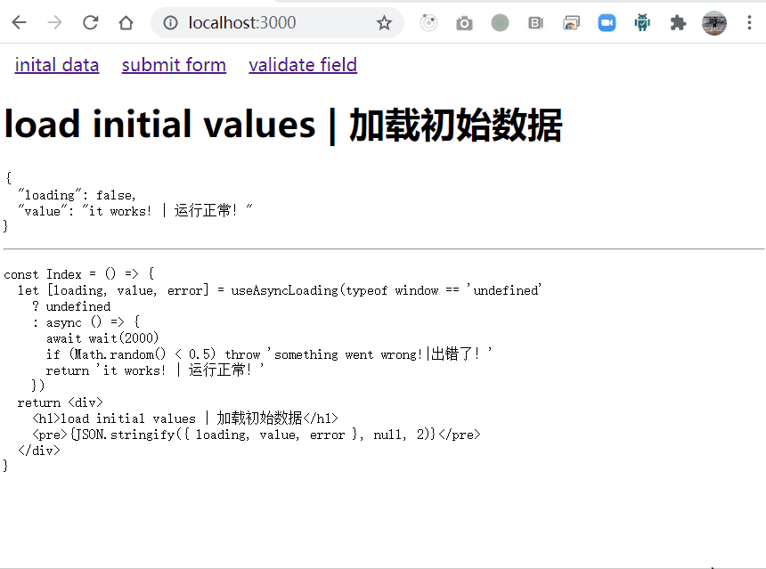

# use-async-loading
react hook to change loading state according to async function or promise | 用来管理异步函数或 promise 的 loading 状态的 react hook



## usage

```
import useAsyncLoading from 'use-async-loading'

let [loading, value, error, start] = useAsyncLoading(initialAsyncFunction)
```

## use case | 场景

### load initial values | 加载初始数据

```
const Index = () => {
  let [loading, value, error] = useAsyncLoading(async () => {
      await wait(2000)
      if (Math.random() < 0.5) throw 'something went wrong!|出错了！'
      return 'it works! | 运行正常！'
    })
  return <div>
    <h1>load initial values | 加载初始数据</h1>
    <pre>{JSON.stringify({ loading, value, error }, null, 2)}</pre>
  </div>
}
```

### submit form | 提交表单

```
const Submit = () => {
  let [loading, value, error, start] = useAsyncLoading()
  return <div>
    <h1>submit form | 提交表单</h1>
    <button disabled={loading} onClick={() => start(async () => {
      await wait(2000)
      if (Math.random() < 0.5) throw 'something went wrong!|出错了！'
      return 'it works! | 运行正常！'
    })}>submit</button>
    <pre>{JSON.stringify({ loading, value, error }, null, 2)}</pre>
  </div>
}
```

### validate field | 验证字段格式

```
const Submit = () => {
  let [loading, value, error, start] = useAsyncLoading()
  return <div>
    <h1>validate field | 验证字段格式</h1>
    <input
      placeholder="only number allowed | 只允许数字"
      onChange={e => start(async () => {
        let valid = /^d*$/.test(e.target.value)
        await wait(1000)
        if (!valid) throw 'something went wrong!|出错了！'
        return 'it works! | 运行正常！'
      })} />
    <pre>{JSON.stringify({ loading, value, error }, null, 2)}</pre>
  </div>
}
```